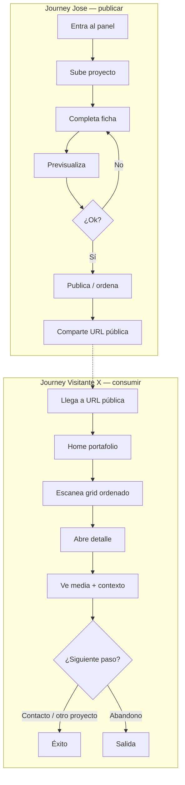
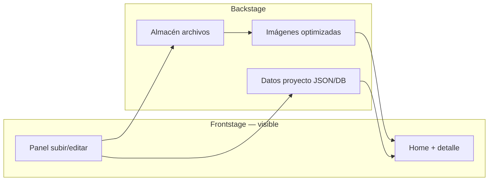
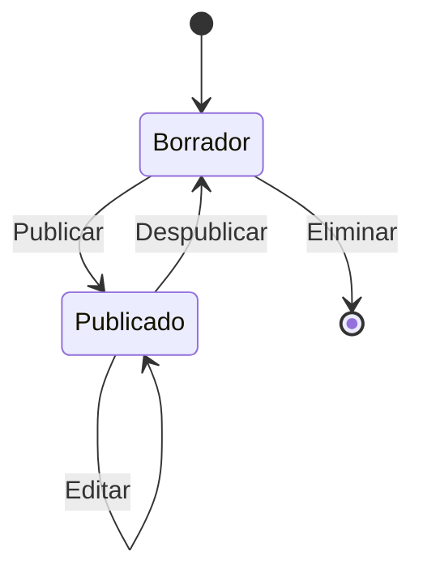

# Journey map — Sistema de portafolio (subir proyectos + vista pública)

**Producto:** Portafolio personal donde Jose sube proyectos y cualquier visitante los explora de forma clara y atractiva.  
**Versión del mapa:** 1.0 · Taller Interfaces UAI

---

## Personas

| Persona | Objetivo | Éxito |
|--------|----------|--------|
| **Jose (dueño)** | Publicar y ordenar trabajos sin tocar código | Un proyecto nuevo queda en línea en minutos, con imagen, texto y orden correcto |
| **Visitante X** | Entender quién es Jose y ver 1–2 casos en profundidad | En &lt; 2 min sabe de qué va el portafolio y puede compartir o contactar |
| **Visitante curioso (link directo)** | Abrir un proyecto concreto (`/proyecto/slug`) | Ve el caso completo sin perderse en la home |

---

## Mapa global (dos journeys en un sistema)

---

## Journey 1 — Jose: de idea a proyecto publicado

### Etapas

| # | Etapa | Acción | Pensamiento | Oportunidad de diseño |
|---|--------|--------|-------------|------------------------|
| 1 | **Entrada** | Abre panel (web o app) / inicia sesión | “Quiero sumar el caso de la impresora” | Login simple; recordar sesión; enlace “Ver sitio público” siempre visible |
| 2 | **Crear** | “Nuevo proyecto” | “¿Qué me piden?” | Wizard corto: título → imagen → descripción → publicar |
| 3 | **Subir media** | Arrastra PNG/PDF/video o elige de galería | “¿Se ve bien en la tarjeta?” | Crop automático para thumbnail + hero; peso máximo claro; barra de progreso |
| 4 | **Contenido** | Título, subtítulo, descripción, tags, año, rol | “No quiero repetir texto en dos lados” | Un solo formulario alimenta tarjeta y detalle |
| 5 | **Orden** | Arrastra tarjetas o asigna “destacado” | “El mejor trabajo arriba” | Orden manual + opción “pin” en home |
| 6 | **Preview** | Ve exactamente lo que verá Visitante X | “¿Se ve lindo en móvil?” | Preview desktop/móvil side by side |
| 7 | **Publicar** | Guarda → estado “Publicado” | “Listo para mandar el link” | Confirmación + copiar link del proyecto y de la home |
| 8 | **Éxito** | Comparte URL; opcional editar después | “Puedo iterar sin romper nada” | Borrador vs publicado; historial mínimo de cambios |

### Momentos críticos (Jose)

- **Subida fallida** → mensaje claro (formato, tamaño, red), no pantalla en blanco.
- **Desincronización tarjeta/detalle** → evitar dos copias de texto (una fuente de verdad).
- **Miedo a “romper” el sitio** → preview obligatorio antes de publicar.

---

## Journey 2 — Visitante X: de link a confianza

### Etapas

| # | Etapa | Acción | Pensamiento | Oportunidad de diseño |
|---|--------|--------|-------------|------------------------|
| 1 | **Entrada** | Abre link (home o proyecto) | “¿Quién es y qué hace?” | Hero breve: nombre, rol, 1 línea; sin “portafolio de ejemplo” |
| 2 | **Orientación** | Scroll en home | “¿Por dónde empiezo?” | Grid consistente: imagen real, título, 1 línea, año/tag |
| 3 | **Selección** | Clic en tarjeta (toda la card) | “Este caso me interesa” | Hover sutil; card entera clickeable |
| 4 | **Detalle** | Modal o página `/p/slug` | “Quiero ver el diagrama” | Hero grande; zoom en imagen; texto legible |
| 5 | **Comprensión** | Lee contexto: problema, rol, herramientas | “Entiendo el aporte” | Bloques fijos: Contexto · Rol · Resultado |
| 6 | **Siguiente paso** | Contacto, LinkedIn, otro proyecto | “¿Cómo lo contacto?” | CTA fijo: Email / LinkedIn; “Siguiente proyecto” |
| 7 | **Éxito** | Comparte link o escribe | “Se ve profesional” | OG image por proyecto; URL limpia |

### Momentos críticos (Visitante)

- **Imagen rota o placeholder** → pierde confianza al instante (prioridad #1 en implementación).
- **Demasiados placeholders** → mejor 2 proyectos reales que 6 vacíos.
- **Sin CTA** → el journey muere después del detalle.

---

## Service blueprint (capas)

**Opciones de implementación (sin decidir stack aún):**

| Enfoque | Jose sube | Visitante ve | Esfuerzo |
|---------|-----------|--------------|----------|
| **A. CMS headless** (Sanity, Contentful) | Formularios en CMS | Sitio estático/Next | Medio; muy ordenado |
| **B. GitHub + carpeta `projects/`** | Sube JSON + imágenes al repo | GitHub Pages | Bajo; menos “arrastrar y soltar” |
| **C. Panel propio + Supabase/Firebase** | Web app auth + upload | Misma app, ruta pública | Alto; control total |

Para tu contexto (taller + diseñador): **A o B primero**, **C** si quieres producto propio.

---

## Estados del proyecto (reglas de negocio)

- **Borrador:** solo Jose en preview.
- **Publicado:** aparece en home y tiene URL propia.
- **Archivado (opcional):** oculto pero no borrado.

---

## Métricas de éxito

| Métrica | Jose | Visitante |
|---------|------|-----------|
| Tiempo a publicar 1 proyecto | &lt; 10 min | — |
| Proyectos con imagen válida | 100% publicados | — |
| Tiempo hasta entender “quién es” | — | &lt; 30 s en home |
| Tasa de rebote en detalle | — | Baja si media carga &lt; 2 s |

---

## Prioridad de diseño (MVP del journey)

1. **Una fuente de verdad** — un registro por proyecto (título, slug, thumb, hero, descripción, orden, estado).
2. **Subida con feedback** — drag & drop, validación, preview de tarjeta y detalle.
3. **Home ordenada** — grid responsive, tipografía clara, sin PLACEHOLDER en lo publicado.
4. **Detalle que cierre** — media grande + bloques de contexto + un CTA de contacto.
5. **URL compartible** — `/proyecto/interfaz-impresora` además de hash.

---

## Relación con el sitio actual (`index.html`)

| Hoy | Sistema objetivo |
|-----|------------------|
| Array `projects` en HTML | JSON o CMS |
| Imagen referenciada pero no en repo | Upload → storage con URL segura |
| Texto duplicado card/modal | Mismo objeto renderiza ambos |
| Solo “Ver proyecto →” | Card completa + slug en URL |

---

## Próximo paso sugerido

Definir **MVP de 2 pantallas**: (1) panel “Nuevo proyecto” con upload + preview, (2) home pública generada desde esos datos. El journey map de arriba es la guía para no saltarse preview, orden ni CTA en el detalle.
